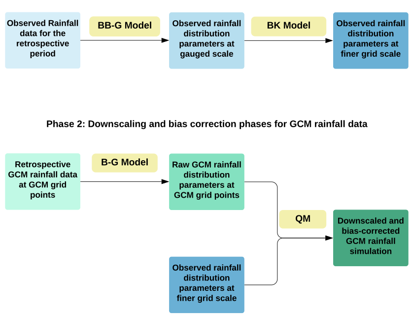

# Lima Methodology Flow Chart

# Estimating PDF Parameter Values at Observation Sites

In (Lima, 2021, https://doi.org/10.1016/j.jhydrol.2021.126095) a Bernoulli-Gamma distribution is assumed for daily rainfall, which has the form:

\begin{equation}
    P(Y_{jk}=y_{jk}) = B(1,p_{jk})\cdot G(y_{jk}|\alpha_{jk},\beta_{jk})
\end{equation}

\begin{equation}
\begin{split}
B(1,p_{jk})\cdot G(y_{jk}|\alpha_{jk},\beta_{jk}) = & \ p_{jk} \cdot \dfrac{{\beta_{jk}}^{\alpha_{jk}} y_{jk}^{\alpha_{jk}-1}e^{-\beta_{jk} y_{jk}}}{\Gamma(\alpha_{jk})} & \} \text{Rainfall} \\
& (1-p_{jk}) & \} \text{No Rainfall}
\end{split}
\end{equation}

The Bernoulli part gives the probability of rainfall (p) or no rainfall (1-p) on a given day at the site \(j\) for month \(k\) and the Gamma part gives the probability of an intensity of rainfall ($y_{jk}$) on that day given rainfall occurs. The gamma distribution has shape parameter $\alpha$ and scale parameter $\beta$. Note: it makes sense to include a Bernoulli term because of the discontinuity expected for the probability of no rainfall. The shape/scale parameters $\alpha$ and $\beta$ are estimated at every rainfall gauge and for each month of the year. 

Bayesian inference is used to estimate the parameters $p,\alpha,\beta$ for every rainfall gauge [j] and month [k]. 

\begin{equation}
    Posterior = \dfrac{Likelihood \cdot Prior}{Normalising Constant} 
\end{equation}

\begin{equation}
    P(\boldsymbol{p,\alpha,\beta}|\boldsymbol{y}) = \dfrac{P(\boldsymbol{y}|\boldsymbol{p,\alpha,\beta}) \cdot P(\boldsymbol{\boldsymbol{p,\alpha,\beta}})}{P(\boldsymbol{y})} 
\end{equation}

\begin{equation}
    P(\boldsymbol{y}|\boldsymbol{p,\alpha,\beta}) = \prod_{jk} B(1,p_{jk})\cdot G(y_{jk}|\alpha_{jk},\beta_{jk})
\end{equation}

\begin{equation}
    P(\boldsymbol{\boldsymbol{p,\alpha,\beta}}) = \prod_{jk} P(p_{jk}) \cdot P(\alpha_{jk}) \cdot P(\beta_{jk})
\end{equation}

\begin{equation}
    P(\boldsymbol{y}) = \iiint\limits_{p,\alpha,\beta} P(\boldsymbol{y}|\boldsymbol{p,\alpha,\beta})\cdot P(\boldsymbol{p,\alpha,\beta}) \,dp\,d\alpha\,d\beta
\end{equation}

The parameters $[p,\alpha,\beta]$ are treated as stochastic variables here with probability distributions to estimate (the posterior distribution). In addition to simply estimating the parameters that maximise the likelihood, treating the parameters as stochastic variables allows us to estimate a credible interval and plot the uncertainty on our modelled PDF of rainfall/snowfall.

Note we don't need the normalising constant $P(\boldsymbol{y})$ to estimate the most likely values of the parameters $\theta=[p,\alpha,\beta]$ (MAP), but we do need it for normalising the distributions of the parameters and so for uncertainty estimates. Note also that MLE is just MAP but with uniform priors and that MAP is not much more difficult than MLE and can be done with a basic minimizer. The point of full Bayesian inference is we are actually getting a posterior probability, which is harder to do than to just maximise it. This gives us a distribution over the parameters with which to construct credible intervals. 

In Lima, 2021 it is noted that there exists a spatial correlation between $\alpha_{jk}$ and $\beta_{jk}$, which we want to preserve in the model and so we specify $\beta_{jk}$ as a log normally distributed linear function of $\alpha_{jk}$.

\begin{equation}
\beta_{jk} \sim  LN(a_0+a_1 \cdot \alpha_{jk},\sigma^{2})
\end{equation}

The set of parameters $[a_0,a_1,\sigma]$ are hyper-parameters, in that they are not dependent on j or k.

\begin{equation}
P(\boldsymbol{y}|\boldsymbol{p,\alpha,\beta}) = \prod_\limits{ijk} B(1,p_{jk})\cdot G(y_{i}|\alpha_{jk},a_{0k},a_{1k},{\sigma_k}^2)
\end{equation}

\begin{equation}
\begin{split}
Log Likehood & = Log(\prod_\limits{ijk} B(1,p_{jk})\cdot G(y_{i}|\alpha_{jk},a_{0k},a_{1k},{\sigma_k}^2)) \\  & = \sum_\limits{ijk} Log(B(1,p_{jk})) + \sum_\limits{ijk} Log( G(y_{i}|\alpha_{jk},a_{0k},a_{1k},{\sigma_k}^2))
\end{split}
\end{equation}

MCMC is used to estimate the full posterior distribution $P(\boldsymbol{p,\alpha,\beta}|\boldsymbol{y})$ and works by evaluating the loglikelihood * logpriors for lots of different values of [$p_{jk},\alpha_{jk},a_{0k},a_{1k},{\sigma_k}^2$] and from an acceptance probability working out the normalising constant.

# Kriging PDF Parameter Estimates at Observation Sites across Domain

Given parameter estimates $\boldsymbol{S}=[\boldsymbol{p},\boldsymbol{\alpha},\boldsymbol{\beta}]$, it is assumed the spatial distribution of these parameters follows a multivariate normal distribution (MVN) with mean $\boldsymbol{\mu}$, spatial variability scale $\tau^2$ and unscaled covariance matrix $\boldsymbol{\Sigma}$:
\begin{equation}
\boldsymbol{S}\sim MVN(\boldsymbol{\mu},\tau^2\boldsymbol{\Sigma})
\end{equation}

The equivalent non-parametric representation is described through a Gaussian Process, where $\boldsymbol{\mu}$ now represents a mean function and $\boldsymbol{\Sigma}$ the unscaled covariance function:
\begin{equation}
\boldsymbol{S}\sim GP(\boldsymbol{\mu},\tau^2\boldsymbol{\Sigma})
\end{equation}

The covariance function is here chosen to be a function of the distance between points and some hyperparameters $\theta$:
\begin{equation}
\boldsymbol{\Sigma_{ij}} = f(d_{ij}|\theta) 
\end{equation}

In Lima,2021 the powered exponential family is chosen:
\begin{equation}
f(d_{ij}|\theta) = exp({-\phi \cdot d_{ij})^\kappa})
\end{equation}

$\phi$ impacts how quickly correlation decays with distance (large phi means the correlation decays rapidly) and $\kappa$ impacts the shape of the decay of correlation with distance - See exploring Exponential Covariance Function notebook. 

If we do not expect any simple underlying mean function to act on the data, we can standardise our response variable and set $\boldsymbol{\mu}=0$, then we just need to estimate the parameter $\tau$ and the hyperparameters $[\phi,\kappa]$. This could be done through MLE, although doing so through a bayesian framework allows easier handling of uncertainties.

\begin{equation}
P(\alpha)\sim GP(0,\tau^2\boldsymbol{\Sigma})
\end{equation}

Through marginalisation and with observations of the response variable $\boldsymbol{\alpha}_{obs}$ :
\begin{equation}
Likelihood = P(\boldsymbol{\alpha}_{obs})\sim MVN(0,\tau^2\boldsymbol{\Sigma}_{obs})
\end{equation}

Where $\boldsymbol{\Sigma}_{obs}(ij) = exp({-\phi \cdot d_{ij})^\kappa})$

Priors need to be chosen for each parameter/hyperparameter, the ones used in Lima,2021 are:

\begin{equation}
P(\tau^2)\sim Inv-Gamma(0.01,0.01)
\end{equation}

\begin{equation}
P(\phi)\sim Uniform(\phi_{min},\phi_{max})
\end{equation}

where:
\begin{equation}
\phi_{min} = -log(\rho_{max}/d_{max}) 
\end{equation}
\begin{equation}
\phi_{max} = -log(\rho_{min}/d_{min})
\end{equation}

Note in Lima,2021 it is assumed $\kappa=1$, it is found that including $\kappa$ in the MCMC algorithm makes it extremely slow and estimations are hard to achieve. 
